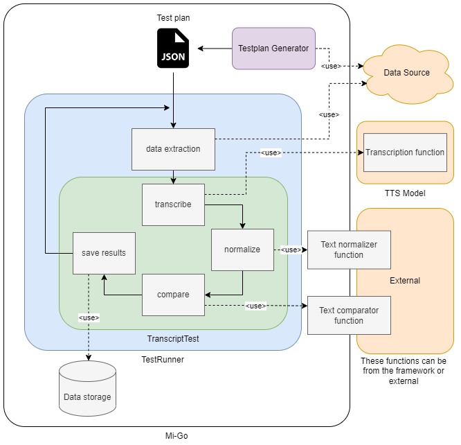

# Mi-Go

## Description

Mi-Go is an open-source test framework designed to evaluate and compare the accuracy of speech-to-text models. It
provides a flexible and extensible approach to generating test plans and executing tests on various datasets, including
YouTube videos, podcasts, and other audio sources. With Mi-Go, users can easily benchmark different models, compare
their performance, and identify areas for improvement.

Mi-Go is suitable for researchers, developers, and data scientists working in the field of speech recognition. It is
designed to simplify the testing process and provide a standardized framework for evaluating and comparing
speech-to-text models.

Currently, the framework mainly focuses on YouTube datasets, but we believe it can be easily extended to other datasets
as well.

### General idea of the framework



## Motivation

The primary goal of Mi-Go is to offer a user-friendly script for speech-to-text model validation on YouTube videos.
YouTube presents an extensive and regularly updated corpus of spoken language data, encompassing diverse languages,
accents, dialects, speaking styles, and audio quality levels. This makes it an optimal platform for assessing the
adaptability and performance of speech recognition models in real-world scenarios.

Additionally, Mi-Go is motivated by the desire to test the latest state-of-the-art model for speech
recognition, [Whisper](https://github.com/openai/whisper), which is open-source and freely available on GitHub.


# Framework structure

## Testplan generator

The Testplan generator is a script that generates test plans as JSON files for a specific TestRunner.

**YouTube Testplan generator** is an example of such a generator designed for testing on YouTube videos. It uses the
YouTube Data API to fetch videos and youtube-transcript-api to obtain their transcripts. Users can filter videos by
language, category, duration, and other criteria.

## TestRunner

The [TestRunner](src/youtube_runner.py) is a script that
executes tests on a specific dataset/testplan, meaning it is designed to work with a particular dataset and testplan. It
prepares the data for testing, runs the tests, and stores the results in a database. The TestRunner features a register
decorator that allows users to easily add new transcript test to the class so they can be easily chosen in command-line
arguments.

**YouTubeTestRunner** is an example of such a runner designed for testing on YouTube videos. It uses the testplan
generated by the YouTube testplan generator and prepares the data by downloading audio and subtitles. Results are stored
in a SQLite database and also in a JSON file, which has the same structure as the testplan but with results so it can be
used to generate the next testplan iteration.

## TranscriptTest

The [TranscriptTest](src/transcript_test.py) is a
model-specific script that runs the speech-to-text model and compares its output to the ground-truth transcript.

**TranscriptDifference** is an example of such a transcript test designed for testing Whisper models but can be used for
other models as well. It normalizes the transcripts using a built-in Whisper normalization function and uses a JiWER
library to calculate speech recognition metrics.

### Databases

The [Databases](src/database) is a SQLite database that stores the
results of the tests, so they can be easily accessed, filtered and analyzed. Designed to support YouTubeTestRunner.

## Installation

### Requirements

- Python 3.10+
- [Whisper](https://github.com/openai/whisper) (optional)
- [ffmpeg](https://ffmpeg.org/) (optional)

### Install

1. Clone the repository
2. Install the requirements

```
pip install -r requirements.txt
```

## Usage Linux

Add source directory to the PYTHONPATH

```
export PYTHONPATH=<path_to_source_directory>
```

Add Google API key to the config to environment variables

```
export GoogleAPI=<your_google_api_key>
```

Run the testplan generator, example:

```
python generators/youtube_generator.py 10 -o ./testplans -c 27 -l en
```

Run the testrunner, example:

```
python youtube_runner.py ./testplans/{testplan.json} DummyTest
```

Bibtex
```
@Article{MiGo2024,
author={Wojnar, Tomasz and Hryszko, Jaros{\l}aw and Roman, Adam},
title={Mi-Go: tool which uses YouTube as data source for evaluating general-purpose speech recognition machine learning models},
journal={EURASIP Journal on Audio, Speech, and Music Processing},
year={2024},
month={May},
day={01},
volume={2024},
number={1},
pages={24},
issn={1687-4722},
doi={10.1186/s13636-024-00343-9},
url={https://doi.org/10.1186/s13636-024-00343-9}
}
```


